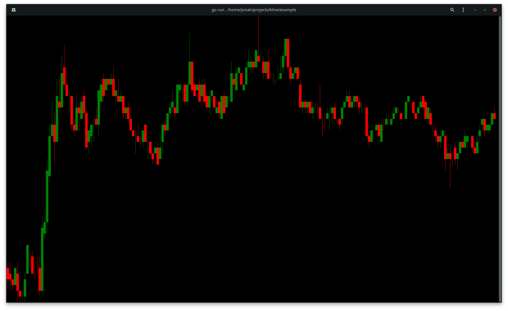

# kline

A [bubbletea][bubbletea] bubble to render klines in the terminal

[bubbletea]: https://github.com/charmbracelet/bubbletea

This is currently more a proof of concept than a working library.

## Screenshot
